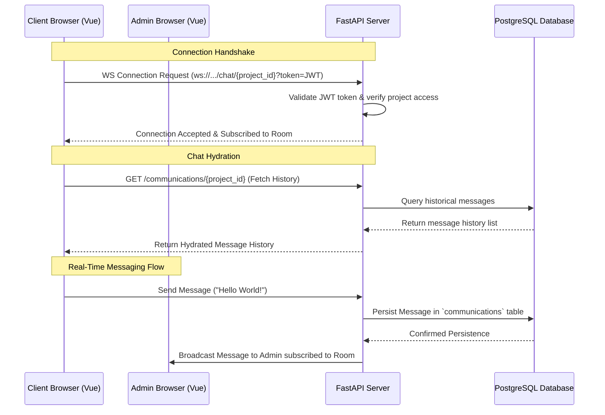

# Milestone Documentation: Persistent Real-Time Communication

This document records the implementation of the WebSocket-based real-time communication system, enabling instant, secure, and persistent collaboration between developers (administrators) and clients.

---

## 🏗️ Architectural Overview

The communication module replaced legacy static mockups with a dynamic, secure bi-directional WebSocket infrastructure.

### 1. WebSocket Infrastructure (`ConnectionManager`)
- **Isolation**: Implemented room-based connection management in `backend/src/routers/chat.py`. Connections are grouped by `project_id`, preventing cross-project message leakage.
- **Broadcasting**: Real-time message streaming using asynchronous context managers to push updates instantly to all connected users in a room.

### 2. Message Persistence
- Every received message is instantly stored in the `communications` PostgreSQL database table before broadcast, ensuring zero message loss and complete history preservation.
- History is fetched via REST API upon mounting the chat component to hydrate the chat screen with older messages before initializing the live socket connection.

### 3. Handshake Security & Authentication
- **Token Validation**: FastAPIs native security does not directly support standard headers in WebSocket handshakes on all browsers. To bypass this, token authentication is sent securely via query parameters: `ws://.../chat/{project_id}?token=<jwt_token>`.
- The token is parsed and validated using the existing `oauth2_util` module on the backend to authenticate the connection.

---

## 🧪 Walkthrough & Functional Flow

### 1. The Premium Common Chat Box (`ChatBox.vue`)
- **Location**: `frontend/app/components/common/ChatBox.vue`
- **Premium Glassmorphic Design**: Fully translucent background utilizing standard Tailwind opacity-based borders (`bg-white/60 dark:bg-gray-800/60 backdrop-blur-xl`).
- **Dynamic Scrolling**: Implemented reactive scrolling logic (`scrollToBottom`) which triggers on layout change or whenever a new message is received.
- **Visual Connection Indicators**: Displays a green dot or a warning badge indicating socket status (`CONNECTED`, `RECONNECTING...`, `DISCONNECTED`).
- **Resilient Auto-Reconnection**: Built-in exponential back-off reconnection loop which triggers automatically on random disconnections.

### 2. Unified Dashboards Integration
- **Admin Project Panel**: Embedded at the right column of `/admin/projects/[id].vue`.
- **Client Project Dashboard**: Embedded at `/client/[id].vue`.
- Both views utilize the identical `<CommonChatBox :project-id="id" />` component to guarantee feature parity.

### 3. Layout and Route Boundary Protection
- Handled the layout degradation issue where admins clicking on a project were redirected to `/client/[id]`, which forced the Nuxt framework to switch layouts to the Client sidebar.
- **Fix**: Segregated navigation paths so that administrators are strictly routed to `/admin/projects/[id]` and clients are routed to `/client/[id]`, preserving layout continuity.

---

## 📋 Verification Summary

| Feature | Test Case | Result |
| :--- | :--- | :--- |
| **Authentication** | WS Connection without token / with invalid token | `403 Forbidden` / Disconnected (Passed) |
| **Room Isolation** | Send message to Project A room and observe Project B | Zero leakage (Passed) |
| **Durable History** | Reload page after sending message | Retains complete history from DB (Passed) |
| **Autoscrolling** | Send multiple long messages | Auto-scrolls to the bottom instantly (Passed) |
| **Auto-reconnection** | Kill backend service and restart it | Client automatically reconnects after recovery (Passed) |
| **Layout Boundary** | Click Project from Admin Dashboard | Admin remains in `/admin/projects/[id]` (Passed) |

---

> [!TIP]
> **Next Steps**: With persistent, real-time collaboration successfully documented and operational, we can proceed to build the **Project File Management vault** allowing users to share project assets directly inside the chat workspace.
